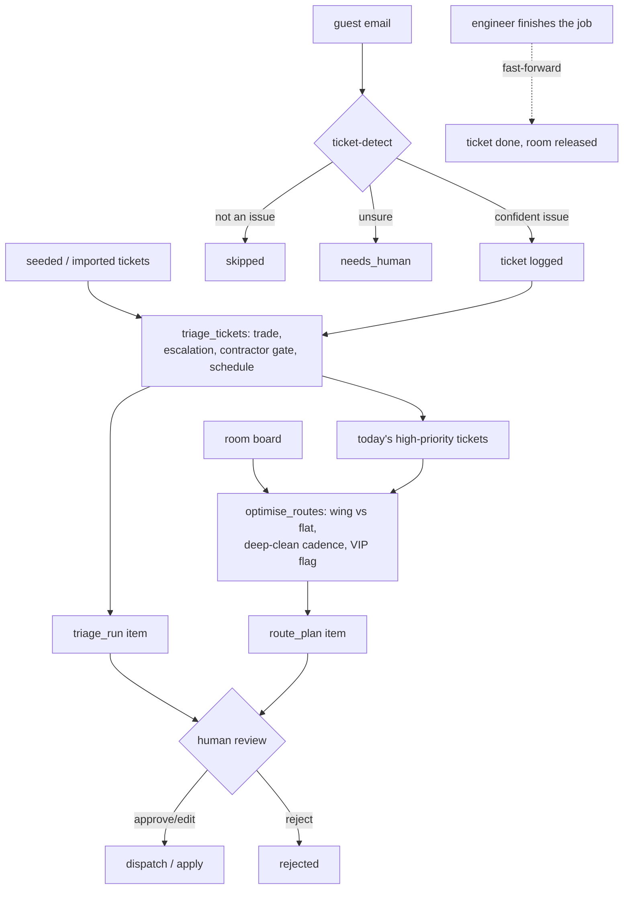

# Housekeeping & Maintenance AI — "The Steward"

Builds the optimal cleaning route from arrivals/departures/stayovers, predicts linen needs, logs maintenance tickets from guest messages, and triages them with context — a VIP arriving in five days bumps that room's repair up the list. Tracks turn-around time and keeps engineering holds visible on the live room board.

This is a standalone repo you clone and run yourself, on your own Claude Code
subscription or your own API key. Nothing in it talks to TH1's infrastructure.

## What it does

**Does.** Builds the optimal cleaning route from arrivals/departures/stayovers, predicts linen needs, logs maintenance tickets from guest messages, and triages them with context — a VIP arriving in five days bumps that room's repair up the list. Tracks turn-around time and keeps engineering holds visible on the live room board.

**Won't.** Doesn't replace the inspector's sign-off.

**Why.** Turn time is the constraint on same-day re-sells; maintenance issues hide in emails.

**Output.** Faster room turns + fewer missed maintenance items; protect occupancy on back-to-back nights.

**Measured as.** -22% room-turn time (labor). See "Measuring the benefit" below for how to check this on your own property, and `docs/benefits.md` for the full case.

Two honest notes on the promise above, in full in `docs/how-it-works.md`
("Design decisions"):

- **Predicting linen needs** is not implemented in this repo - it belongs to
  a separate agent in this family, `procurement-supply-ai`, which handles
  circulating stock. Run that one alongside this one if you want it.
- **Logging maintenance tickets from guest messages** works today through
  one extra step this template adds beyond the source demo it was built
  from: `tools/ticket_intake.py` reads unread guest email and asks a model,
  once per message, whether it describes something broken. See "How it
  works".

## Who it's for

An independent or boutique property with its own housekeeping team and at
least one maintenance engineer - the kind of place where the morning routine
is still "print the arrivals list and walk the floor" and maintenance
requests live in someone's head, a notebook, or a scattered WhatsApp thread.
It assists the head housekeeper (who still owns the final call on every
route) and the chief engineer (who still owns every sign-off), rather than
replacing either.

It is not a fit if you already run a full CMMS with its own routing and
scheduling, or if your rooms are managed by a single person who does not
need a formal route at all.

## How it works



One pass (`tools/run.py`, `make run`): check new guest email for a
maintenance issue, triage every open ticket, build today's cleaning routes
with that triage interleaved. Two engines do all the deciding
(`tools/engine.py`) - pure functions, no I/O, no model call. The model's only
jobs are: classify whether an email describes a maintenance issue, and write
a short narrative once the routes and the triage are already decided. Full
detail, the exact rule order, and the design decisions taken where the
source demo left something unspecified: `docs/how-it-works.md`.

**Modes.** `shadow` (default): computes and queues, never exports a route or
posts to a channel. `live`: a route plan or triage run a human approved is
really dispatched/applied. Nothing about the safety/VIP escalation rules or
the contractor sign-off gate changes between modes - see "Guardrails &
safety".

**The review loop.** Every route plan and every triage run waits in one
queue (`tools/review.py`) until a person approves, edits the narrative, or
rejects it. `workflows/80-review.md` covers this in full.

**What runs when:**

| Workflow | Cadence | Provider used |
|---|---|---|
| `workflows/10-routes.md` + `workflows/11-triage.md` (`tools/run.py`) | every 30 min, or `make watch` | whatever `llm.provider` is set to |
| `workflows/80-review.md` (`tools/review.py`) | whenever a human is available | none - queue operations only |
| `tools/review.py send` | after an approval | none for deciding; the sheets/messaging adapters' writes |
| `workflows/12-locks.md` (`tools/locks.py`) | on demand | none |

**A built-in feature, not a sub-agent.** The Locksmith (`tools/locks.py`) - a
small audit log for issuing and revoking a room key or code - ships with
every clone of this repo, always on, with nothing to enable. It is not one
of this family's "sub-agents" in the config-toggle sense. See "Sub-agents in
this repo" below and `docs/sub-agents.md`.

## What you need

To run the demo below: nothing but Python 3.11+.

To run it for real:

- **A room board and a ticket list.** CSV exports from your PMS/CMMS
  (`docs/integrations.md` has the exact columns), or hand-maintained CSVs if
  you do not have either yet. Nothing here requires a live PMS connection.
- **A mailbox** (optional) - only used to catch a maintenance issue
  mentioned in a guest email. IMAP works with any provider.
- **A PMS read connection** (optional) - only used to confirm a VIP guest's
  upcoming arrival for the escalation rule. Skip it and that one rule simply
  never fires.
- **A channel for the finished plan** - a CSV export always works
  (`systems.sheets.adapter: csv`); WhatsApp or a webhook for the staff
  notification if you want one (`systems.messaging.adapter`).
- **A way to think** - `llm.provider: interactive` needs only the Claude
  Code session you already have open; `claude-code` and `anthropic` are
  covered in `docs/how-it-works.md` and `docs/safety.md`.

Time estimate: 15 minutes to see the demo, half a day to point it at your own
room board, ticket list and engineers.

## Quick start (5 minutes, no credentials)

```bash
git clone https://github.com/th1-ai/housekeeping-maintenance-ai.git housekeeping-maintenance-ai
cd housekeeping-maintenance-ai
make setup
make demo
```

Expect to see something like:

```
The Steward demo - Hotel Aurora, day 0

1) Checking guest email for maintenance issues (fixtures/inbound/*.json)
  email-01: "AC not working in room 206" -> ticket guest-xxxxxxxxxx logged for room 206 (...)
  email-02: "Small leak under the bathroom sink, room 202" -> ticket guest-xxxxxxxxxx logged for room 202 (...)
  email-03: "Check-in time this Friday" -> not a maintenance issue, skipped
  email-04: "Lovely stay so far" -> needs_human (low-confidence maintenance detection)

2) Triaging every open ticket (seeded + guest-detected)
  Triaged 15 ticket(s): 6 escalated, 1 held for sign-off, 3 to Friday.
  ...
  triage run <id>: status needs_human

3) Building today's cleaning routes
  Reading the PMS board - 31 of 42 rooms need a visit (13 full cleans, 10 stayovers, 8 arrival checks).
  Wing routing: 11.2 min walking across the house vs 22.4 min on the flat worklist - 11.2 min saved, ...
  3 route(s), 31 rooms, 13.1 cleaning hours.
  route plan <id>: status needs_human

4) The Locksmith: issue a contractor code, then revoke it
  issue   room Sauna Plant - Contractor sauna seal repair code
  revoke  room Sauna Plant - Repair finished

Nothing was sent: mode is shadow, and demo never calls `tools/review.py send` at all.

DEMO OK — 2 items processed, 2 drafted, 0 sent (shadow)
```

Then `make doctor` - expect one `FAIL` (`hotel identity`, because the
property is still the shipped placeholder "Hotel Aurora") and a couple of
`warn` lines. That is the intended state of a fresh clone; see
`workflows/00-setup.md`.

## Set up with Claude Code

Open `claude` in this folder. Work through these prompts one at a time -
each phase names the workflow file Claude will follow.

**Phase 1 - first run.**

> Read `workflows/00-setup.md` and walk me through it. I want to see the
> demo first, then fill in my own property.

**Phase 2 - your property and your team.**

> My hotel is called <name>, <rooms> rooms, timezone <timezone>. My
> housekeeping team is <N> attendants. My two maintenance engineers are
> <name> (mechanical/plumbing/HVAC/carpentry) and <name>
> (electrical/electronics/locks/AV) - one person covering everything? use
> the same name twice. Update `config/hotel.yaml` and `config/agent.yaml`,
> then copy and fill in `knowledge/property.md` and
> `knowledge/trades-and-parts.md`.

**Phase 3 - your room board and ticket list.**

> Read `docs/integrations.md`. I export <PMS/CMMS name> as CSV. Help me get
> `data/imports/room_status.csv` and `data/imports/maintenance_tickets.csv` into `data/imports/` in
> the right columns, and confirm `make doctor` picks them up. If I also want
> the VIP-arrival rule to fire on my own property, help me export
> `data/imports/reservations.csv` and `data/imports/guests.csv` too (the
> `vip` column lives on the guest, not the reservation).

**Phase 4 - run it.**

> Read `workflows/10-routes.md` and `workflows/11-triage.md`. Run
> `make run`, answer any pending prompts, then show me what is waiting for
> review.

**Phase 5 - work the queue.**

> Read `workflows/80-review.md`. Show me the route plan and the triage run
> in plain language, and walk me through approving one.

**Phase 6 - go live, when ready.**

> Read `workflows/90-go-live.md` and tell me honestly whether we are ready,
> item by item.

## Connect your systems

Everything ships on the `mock` adapter (fixtures only, no credentials).

| System | This agent's use | Status | Notes |
|---|---|---|---|
| Room board + ticket list | Read every pass | universal (CSV import, own tables) | Not one of the four adapter systems below - see `docs/integrations.md`. |
| PMS (`systems.pms.adapter`) | VIP-arrival context only, read-only | universal (`mock`/`csv`), built (`cloudbeds`) | Optional - a missing PMS just means the VIP-arrival rule never fires. |
| Email (`systems.email.adapter`) | Catch a maintenance issue in guest mail | universal (`mock`/`imap`), built (`gmail`) | Optional - skip it and only the seeded/imported ticket list feeds triage. |
| Messaging (`systems.messaging.adapter`) | Post the approved narrative to staff | universal (`mock`/`webhook`), built (`unipile`) | Optional - the sheet export works without it. |
| Sheets (`systems.sheets.adapter`) | Export the approved route cards | universal (`csv`), built (`google`) | `csv` always works, no setup. |
| Locks | The Locksmith's audit log | stub | Writes to this agent's own table only - see `docs/integrations.md` to connect a real system. |

Check what is actually working at any time:

```bash
make doctor
```

Full status table, exact env vars, CSV column names for the room board and
ticket list, and the "implement your own" recipe: `docs/integrations.md`.

## Run it

```bash
make run                        # one pass: email check, triage, routes
make run ARGS="--limit 5"       # just the first five new emails
make run ARGS="--dry-run"       # compute everything, write nothing
make watch                      # loop on the configured interval
make review                     # what is waiting for a human
python3 tools/review.py send     # dispatch/apply everything approved
python3 tools/review.py stale    # go-live step: clear the shadow-era queue
make schedule                   # cron / launchd / systemd snippet
make schedule ARGS="--all"      # one snippet per job in config/agent.yaml
make report                     # what the agent did
```

Running a `tools/*.py` script directly, not through `make`? Use
`.venv/bin/python tools/review.py ...`, or `source .venv/bin/activate` once
per terminal session first. Plain `python`/`python3` is whatever your shell
finds on `PATH`, which is not guaranteed to be this repo's virtualenv - only
the `make` targets call `.venv/bin/python` for you automatically.

Two more commands that are not part of the review queue - see
`workflows/11-triage.md` and `workflows/12-locks.md`:

```bash
python3 tools/triage.py complete <ticket_id>   # fast-forward: job is done
python3 tools/locks.py issue --room <r> --detail "<why>"
python3 tools/locks.py revoke --room <r> --detail "<why>"
```

**Scheduling.** `make schedule --target cron|launchd|systemd` prints a
ready-to-install snippet for a Mac, a Linux box, or a small VPS -
`scheduler/` has worked examples of all three. `make schedule ARGS="--all"`
prints one snippet per job listed under `config/agent.yaml: schedule:`
(just `main` in this repo - routes, ticket intake and triage all run
together in one pass; the Locksmith is on-demand and has no schedule entry
at all). Every 30 minutes is the shipped default
(`config/agent.yaml: schedule.main.cadence`); a property with a lighter
ticket volume can run it hourly instead.

**Subscription or API.** `llm.provider: interactive` or `claude-code` uses
the Claude Code subscription you already pay for - a run every 30 minutes is
a handful of short calls a day, well inside normal interactive use.
`anthropic` uses your own API key and is the right answer once you want the
shortest possible interval or are running this on more than one property.
Full note, including the usage-policy caveat for automated subscription use:
`docs/safety.md`.

## Go live

Shadow is the default and the safe place to learn what the agent decides.
Going live means an approved route plan or triage run is really
dispatched/applied - nothing about the escalation rules, the VIP flag, or
the contractor sign-off gate ever changes, in either mode.

Checklist (full version with the reasoning behind each line:
`workflows/90-go-live.md`):

- [ ] `make doctor` is clean.
- [ ] Your real property, team size, engineers and sign-off threshold are in
      `config/hotel.yaml` / `config/agent.yaml` - not the shipped defaults.
      One technician instead of two named trades? Point both
      `engineers.mechanical` and `engineers.electrical` at the same name.
- [ ] Your room board and ticket list come from `data/imports/*.csv`, not
      `fixtures/hotel/`.
- [ ] A few days of real runs have gone through the review queue and you
      trust the trade routing and the escalation reasons.
- [ ] The sheet and the staff channel you will dispatch to are both real.
- [ ] `python3 tools/review.py stale` has been run, so nothing built up
      while `mode: shadow` was on goes out on the first live pass.

```yaml
# config/hotel.yaml
mode: live
```

Go back to shadow the same way, or `AGENT_MODE=shadow` in `.env` for one run
- either stops every dispatch/apply on the next pass, mid-schedule.

## Guardrails & safety

**Never does:**

- Dispatch a route or apply a triage plan in `mode: shadow`, or without an
  approval in `live` mode.
- Skip a safety escalation. A passport locked in a dead safe, a same-day
  inspection, a trip/slip hazard, HACCP/walk-in language, a confirmed VIP
  arrival, and a pilot/day-sleeper's jammed blackout blind all force
  `priority: high` - no config turns any of these off.
- Turn off the VIP flag on the route plan, or the contractor sign-off gate's
  visible trade-off when it is switched off ("no second pair of eyes" is
  always shown, never hidden).
- Absorb overflow silently - more routes than your configured headcount is
  an explicit warning, not silent understaffing.
- Replace the inspector's sign-off. Nothing here marks a room sellable.
- Call a real electronic lock system - The Locksmith writes to its own audit
  table only.

**Data handling.** Guest email passes through PAN redaction on ingestion,
same as every repo in this family, even though a maintenance email is
unlikely to carry a card number. Everything lives in `data/` (gitignored):
`agent.db` (including this agent's own ticket and lock-event tables),
`data/logs/*.jsonl`, `data/exports/`. No cloud service, no telemetry.

**AI disclosure (EU AI Act Article 50).** This agent does not write to a
guest - every output is read by housekeeping and engineering staff, so the
usual guest-facing disclosure line ("This reply was prepared with AI
assistance and reviewed by our team.") does not apply to anything this
template sends today. If you extend `tools/ticket_intake.py` to also reply
to the guest who reported the issue, add that line to the reply then - see
`docs/safety.md`.

Full guardrails, the GDPR summary, and the subscription-vs-API note in full:
`docs/safety.md`.

## Sub-agents in this repo

None on the roster this family is built from. The Locksmith
(`tools/locks.py`, `workflows/12-locks.md`) is a built-in feature that ships
with every clone - always on, nothing to enable, no review gate, because it
only writes to its own audit log and never calls a real lock system. A
separate, top-level agent in this family, Lost & Found AI ("The Finder"),
shares the same physical desk in the demo this template was built from but
is not folded into this repo - it has its own. Full detail:
`docs/sub-agents.md`.

## Customising

**`knowledge/`** - `knowledge/property.md` (rooms, floors, room types) and
`knowledge/trades-and-parts.md` (your engineers, your contractors, what "not a stock
item" means for each trade) ground the two narrative prompts. Neither is
read by the deterministic engine - the trade table and the escalation rules
live in code and config, not prose, so they behave the same every time.

**`prompts/`** - `prompts/route-note.md`, `prompts/triage-note.md` and `prompts/ticket-detect.md` are
plain markdown with a JSON schema each (`prompts/schemas/`). Edit the wording
directly; the schema is what keeps the model's answer usable.

**`config/agent.yaml`** - the five rule toggles
(`wing_routing`, `checkout_first`, `deep_clean_cadence`,
`maintenance_interleave`, `contractor_threshold` - exact before/after for
each in `docs/how-it-works.md`), `housekeeping_headcount`, `engineers`,
`contractor_signoff_threshold`, `engineer_start_hour` / `engineer_close_hour`
/ `travel_minutes_between_jobs`, `service_minutes`, `walking`,
`deep_clean_every` / `deep_clean_extra_minutes`, and
`ticket_detect_confidence_threshold`.

**Adding a trade.** `tools/engine.py`'s `_TRADE_RULES` list is a plain Python
list of `(regex, TradeInfo)` pairs, checked in order, each already carrying
English, Spanish, French, German, Italian and Portuguese keywords for the
same fault (`trade_for()` accent-folds the ticket text first, so "bano" and
"baño" match the same rule). Ask your Claude session to add a trade, or a
keyword in another language, and a test alongside it in
`tests/test_housekeeping_engine.py`.

**Language.** This agent's own output (the two narrative notes) is staff
language, not guest language, so it does not use `core.i18n`'s guest-language
detection. If you localise the narrative for a multilingual engineering team,
add the language to the prompt directly.

## Troubleshooting & FAQ

Full list, kept current as things come up: `workflows/99-troubleshooting.md`.

**A ticket got the wrong trade.** `tools/engine.py`'s `trade_for()` is a
first-match regex table - a summary that happens to contain a word from an
earlier rule can misfire. See "The classifier gets a ticket wrong" in
`workflows/99-troubleshooting.md`.

**A ticket I expected to escalate did not.** The VIP-arrival rule only fires
for a name the PMS confirms is VIP with an upcoming reservation - a name
alone in the ticket text is not enough. The other four escalation rules are
plain keyword checks; read `docs/how-it-works.md` for the exact patterns.

**Can I turn off the VIP flag, or the contractor sign-off note when the rule
is off?** No. Both are unconditional - see "Guardrails & safety".

**Why does `make demo` show small walking-time savings?** The demo hotel has
42 rooms across 3 floors. The mechanism is identical at 500 rooms, where the
same wing-vs-flat comparison adds up to a meaningfully different working day
- see `docs/benefits.md`.

## Measuring the benefit

Roster promise: **-22% room-turn time (labor)**. `tools/report.py`
(`make report`) reads straight from the database:

- Route volume, cleaning hours, and the exact walking-time saved by wing
  routing on your own property (not a demo number).
- Escalation rate and why each ticket was upgraded.
- Contractor sign-off holds.
- Tickets caught from guest email versus seeded/imported.
- Edit rate on the narrative notes (the trust signal for going live).
- LLM spend, zero on `mock`/`interactive`.

Full metric list, what each one is meant to show, and the honest caveats
(no inspector sign-off gate, linen forecasting lives elsewhere, the headcount
and deep-clean cadence are configured rather than measured): `docs/benefits.md`.

## About

Built by [TH1](https://th1.ai) as part of its open-source family of hotel
AI-agent templates. Licence: MIT (`LICENSE`). Want TH1 to set this up, tune
it and run it for you instead of doing it yourself? [th1.ai](https://th1.ai).

**Changelog.** v1 - initial template.
