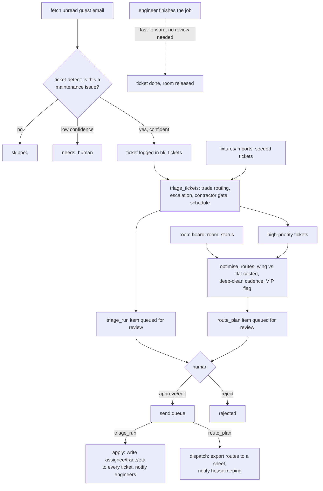

# How The Steward works

Three deterministic engines, one review queue, and two LLM calls that never
touch a number - only the words around it (ARCHITECTURE.md section 1:
"deterministic decisioning, LLM for language").

## The loop

`tools/engine.py` is the whole decision layer - two pure functions,
`optimise_routes()` and `triage_tickets()`, both over plain dataclasses, no
I/O. `tools/routes.py`, `tools/triage.py` and `tools/ticket_intake.py` read
the room board, the ticket table, the PMS and the mailbox, call the engine,
then hand the result to `core.llm.complete()` for a short narrative
(`prompts/route-note.md`, `prompts/triage-note.md`) or a classification
(`prompts/ticket-detect.md`). The model never sees a route or a schedule
before the engine has already decided it - the demo this template was built
from put it plainly: *"Pure functions, no I/O: the page hands over rows read
from Supabase, the engine returns visible thinking steps plus routes /
triage / claim matches. The LLM never touches these numbers."*

## What runs when

| Workflow | Cadence | Provider used |
|---|---|---|
| `workflows/10-routes.md` (`tools/routes.py`, folded into `tools/run.py`) | every 30 min (`config/agent.yaml: schedule.main`), or `make watch` | whatever `llm.provider` is set to (one call: route-note) |
| `workflows/11-triage.md` (`tools/triage.py` + `tools/ticket_intake.py`, folded into `tools/run.py`) | same pass as routes | one call per new guest email (ticket-detect) + one call per triage run (triage-note) |
| `workflows/80-review.md` (`tools/review.py`) | whenever a human is available | none - queue operations only |
| `tools/review.py send` | after an approval, or on its own schedule | none for deciding; the sheets/messaging adapters' writes |
| `workflows/12-locks.md` (`tools/locks.py`) | on demand, whenever a key is issued or revoked | none |

## The five rule toggles (`config/agent.yaml: rules`)

| Rule | On (default) | Off |
|---|---|---|
| `wing_routing` | One floor at a time; the attendant never re-crosses the lift. | One shared worklist, load-balanced across attendants; more floor changes, more walking. |
| `checkout_first` | Departures, then arrival checks, then stayovers. | Room number order only - an arrival check can hit a room that is still dirty. |
| `deep_clean_cadence` | A due checkout/turn room gets `deep_clean_extra_minutes` protected inside its route. | Deep cleans are never flagged; nothing tracks them. |
| `maintenance_interleave` | Every high-priority ticket gets a computed slot inside the route that owns its room, or a direct note for a non-guest-room. | Housekeeping and engineering run blind to each other; only a count of unscheduled tickets is shown. |
| `contractor_threshold` | A contractor-only trade or a >`contractor_signoff_threshold` estimate is held for the chief engineer's sign-off. | The same job books a contractor directly today at 16:00 - the reason text says plainly "no second pair of eyes". |

Both routing layouts (wing and flat) are costed on **every** run regardless of
the toggle, so the walking-time saving in the narrative is provable, not
asserted - see `tools/engine.py:optimise_routes`.

## Trade routing and escalation (`tools/engine.py`)

`trade_for(text)` is a first-match regex table: commercial refrigeration,
in-room safe, spa plant, HVAC, minibar, plumbing, electrical, doorbell,
AV/TV, blinds/curtains, gym equipment, carpentry (two buckets), and a
"general maintenance" fallback. Each rule carries English, Spanish, French,
German, Italian and Portuguese keywords for the same fault (`_fold()`
strips accents first, so "bano"/"baño" match the same rule) - at minimum
the languages a hotel is likely to set in `hotel.languages`. Two engineers
split the trades - `config/agent.yaml: engineers.mechanical` /
`engineers.electrical` - never hardcoded in the engine. One technician
covering every trade instead of two? Point both config keys at the same
name; `_engineer_name()` and `tools/doctor.py:check_engineers` just look up
whatever string is there, so a single name behaves exactly like two.

`escalation_for(ticket, vip_names)` overrides the reported priority to
`high`, in this order: a passport locked in a dead safe, a named inspection
time today, a trip/slip/hazard word, HACCP/walk-in language, a named VIP
guest arriving within a few days, or a pilot/day-sleeper booking with a
jammed blackout blind. `vip_names` is a plain set of lower-cased guest names
the PMS confirms are VIP - built once per pass by `tools/triage.py:vip_names()`
from `pms.list_reservations()`, never looked up inside the engine itself, so
the escalation rule stays a pure text-in/reason-out check.

## Deciding what needs a human

Nothing here calls a guest or writes a ticket's final state without a person
approving it first - `tools/review.py` is the only door out.

- **A triage run** is `needs_human` when at least one ticket was upgraded to
  `high`, or one is held for contractor sign-off; otherwise `pending_review`.
- **A route plan** is `needs_human` when there is a capacity warning or an
  unscheduled high-priority ticket; otherwise `pending_review`.
- **A guest-email ticket detection** below `ticket_detect_confidence_threshold`
  is queued `needs_human` instead of turned into a ticket on trust.
- **Locksmith actions** (`tools/locks.py issue` / `revoke`) are not gated at
  all - they are a direct action a person runs deliberately, the same trust
  level as pressing the button in the source demo. See docs/safety.md.

## Idempotency

- `store.upsert_item("housekeeping-routes", "<date>-day<offset>", ...)` and
  `store.upsert_item("housekeeping-triage", "<date>", ...)` are unique per
  calendar day - a second `tools/run.py --once` the same day returns the
  existing plan/run untouched (`item.intent` is only set once computed).
- `store_ext.seed_tickets()` inserts a fixture ticket once per `id`; a guest
  email becomes at most one ticket (`store.upsert_item("email", msg.id, ...)`
  dedups on `(source, external_id)` before the ticket is even considered).
- Sending is claimed atomically (`Store.claim_for_send()`): two runners
  racing on the same approved item can never both dispatch/apply it.

## Design decisions where the spec was open

The source demo's own build notes left six questions open for whoever built
the real template. Here is what this one does about each:

1. **"Logs maintenance tickets from guest messages"** has no demo mechanism
   to port (all 14 seeded tickets are created by hand). This template adds
   `tools/ticket_intake.py`: one `ticket-detect` LLM call per unread email,
   gated by a confidence threshold, with the low-confidence case queued for
   a human rather than guessed.
2. **"Predicts linen needs"** is out of scope for this repo. It genuinely
   belongs to `procurement-supply-ai`'s circulating-stock handling in the
   source spec, and duplicating that logic here would drift the two repos
   apart. If you run both agents, wire `procurement-supply-ai`'s linen
   forecast to read this agent's `hk_tickets`/room-board data instead of
   rebuilding it.
3. **No inspector sign-off step exists.** The roster's "cant" says this
   agent does not replace one - this template has no sellable/not-sellable
   gate at all, on purpose. Add a PMS `set_room_status` call (guarded,
   `pms_write`) once you have a real inspection workflow to hang it off.
4. **The housekeeping headcount is a config value**
   (`config/agent.yaml: housekeeping_headcount`, default 6 for this
   template's smaller fixture hotel; the source demo used 58 for its 500-room
   property). Set it to your own team size.
5. **Deep-clean cadence is a modulo stand-in**
   (`(room_number + day_offset) % deep_clean_every == 0`), exactly as in the
   source demo - no table tracks a real "N stays since last deep clean"
   count. A real build would add one and read it here instead.
6. **Parts-store levels are not modelled.** Every trade's `parts_note` is a
   fixed string (e.g. "basin cartridge", "not a stock item"); there is no
   live inventory count behind "parts short" warnings.

Two more decisions this template made on its own:

- **"Dispatch to the housekeeping app" and the room board itself are not a
  specific app integration.** There is no named housekeeping-dispatch API to
  build against, so dispatch means: export the route cards to a sheet
  (`systems.sheets.adapter`) and post the narrative to the staff channel
  (`systems.messaging.adapter`). The room board and the seeded ticket list
  are read from `fixtures/hotel/room_status.json` /
  `maintenance_tickets.json` for the demo, or `data/imports/room_status.csv`
  / `maintenance_tickets.csv` for a real property - see
  docs/integrations.md.
- **No guest-facing AI disclosure line.** This agent never writes to a
  guest. Everything it produces is read by housekeeping and engineering
  staff. If you extend `tools/ticket_intake.py` to also reply to the guest
  who reported the issue, add the EU AI Act Article 50 line then - see
  docs/safety.md.

## Where core stops and this agent starts

`core/` is byte-identical to `factory/core/` and shared by every repo in this
family. Everything in `tools/`, `prompts/`, `fixtures/`, `workflows/`,
`knowledge/` and `config/agent.example.yaml` is The Steward's own.
